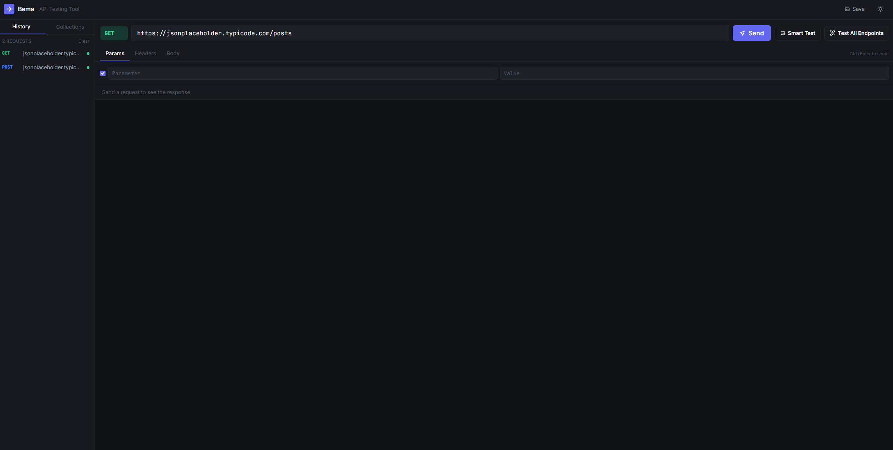
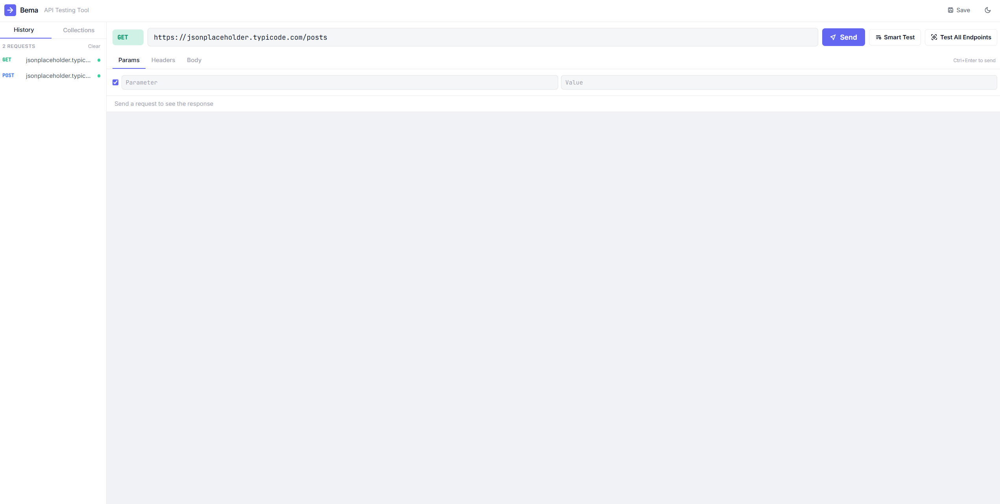
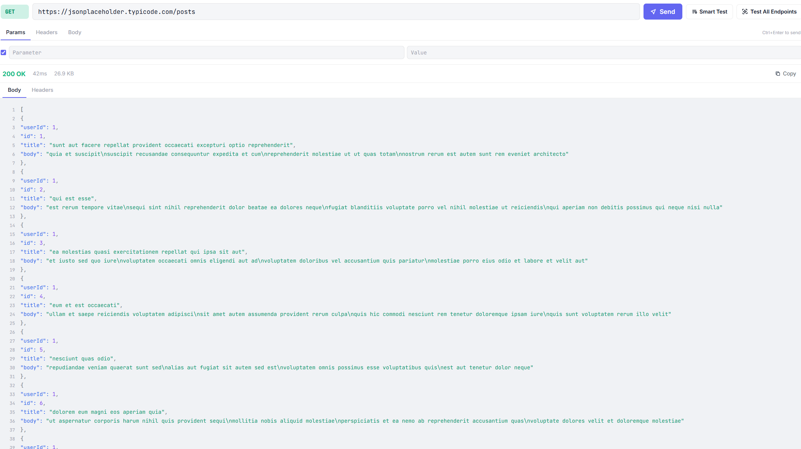
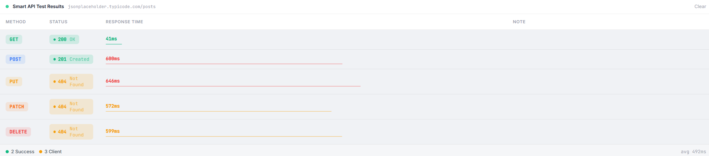
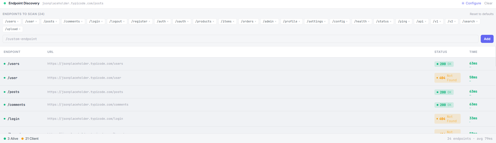

<div align="center">

# ⚡ Bema

### A fast and lightweight alternative to Postman for testing APIs.

[](https://opensource.org/licenses/MIT)
[](https://react.dev)
[](https://vitejs.dev)
[](https://tailwindcss.com)
[](https://nodejs.org)

<br/>

Bema is a **modern, developer-focused API testing tool** that runs entirely in your browser.
Send requests, inspect responses, run automated multi-method tests, and discover hidden endpoints —
all without the bloat of heavy desktop applications.

<br/>



</div>

---

## 🚀 Why Bema?

Most API tools are **over-engineered** for day-to-day development work. Bema is different:

| | Bema | Postman |
|---|---|---|
| Startup time | Instant (browser) | 5–15 seconds |
| Install size | ~5 MB | ~250 MB |
| Smart multi-method test | ✅ Built-in | ❌ Manual |
| Endpoint discovery | ✅ Built-in | ❌ Not available |
| Open source | ✅ MIT | ❌ Proprietary |
| Self-hosted proxy | ✅ Express | N/A |

---

## ✨ Features

### Core Request Builder
- ⚡ Send **GET, POST, PUT, PATCH, DELETE** requests
- 🔑 Key-value editors for **Headers**, **Query Params**, and **Body**
- 🎨 Color-coded method badges with per-method styling
- ⌨️ `Ctrl+Enter` keyboard shortcut to fire requests
- 📋 One-click **copy response** to clipboard

### Response Viewer
- 🧠 **Syntax-highlighted JSON** viewer with line numbers
- 🟢 Color-coded **status badges** (2xx green · 3xx blue · 4xx amber · 5xx red)
- ⏱ **Response time** and **response size** displayed inline
- 📊 Formatted response **headers table**

### 🧪 Smart API Testing
Automatically tests all 5 HTTP methods against your URL in parallel and displays a results table with per-method status codes, response times, and a mini latency bar chart.

```
URL: https://api.example.com/users

Method │ Status │ Time
───────┼────────┼──────
GET    │ 200 OK │ 112ms
POST   │ 401    │ 98ms
PUT    │ 404    │ 105ms
PATCH  │ 404    │ 101ms
DELETE │ 405    │ 94ms
```

### 🔎 API Endpoint Discovery
Scans 24 common REST endpoints against a base URL using a controlled concurrency pool. Results appear live as each probe completes. The endpoint list is **fully configurable** — add, remove, or reset to defaults inline.

```
Base: https://api.example.com

Endpoint   │ Status │ Time
───────────┼────────┼──────
/users     │ 200    │ 118ms
/login     │ 200    │ 95ms
/admin     │ 403    │ 88ms
/products  │ 404    │ 102ms
/health    │ 200    │ 44ms
```

### 📦 Collections & History
- 💾 **Save requests** to named collections with a modal dialog
- 🕓 **Request history** auto-saved (last 50, deduplicated)
- 🗑 Clear history with one click
- 🔁 Re-load any past request instantly from the sidebar

### 🌙 Theme & Persistence
- Dark / Light mode toggle with smooth CSS-variable transitions
- All state persisted to **localStorage** — survives page refresh
- Four isolated storage keys: `bema_history`, `bema_collections`, `bema_saved_requests`, `bema_settings`

---

## 🖥 Screenshots

> _Add screenshots to the `/screenshots` folder and they will appear here._

| Request Builder | Smart Test Results | Endpoint Discovery |
|---|---|---|
|  |  |  |

---

## 🛠 Tech Stack

**Frontend**

| Package | Version | Role |
|---------|---------|------|
| [React](https://react.dev) | 18 | UI framework |
| [Vite](https://vitejs.dev) | 5 | Dev server & bundler |
| [TailwindCSS](https://tailwindcss.com) | 3 | Utility-first styling |
| [Framer Motion](https://www.framer.com/motion/) | 11 | Animations |
| [Axios](https://axios-http.com) | 1.6 | HTTP client |

**Backend**

| Package | Version | Role |
|---------|---------|------|
| [Express](https://expressjs.com) | 4.18 | HTTP server |
| [cors](https://github.com/expressjs/cors) | 2.8 | CORS middleware |
| [Axios](https://axios-http.com) | 1.6 | Proxy outbound requests |
| [nodemon](https://nodemon.io) | 3 | Dev auto-restart |

---

## 📦 Installation

### Prerequisites

- [Node.js](https://nodejs.org) v18 or higher
- npm v9 or higher

### 1. Clone the repository

```bash
git clone https://github.com/BahaaAlazawwy/bema-Lightweight-API-Testing-Tool.git
cd bema-Lightweight-API-Testing-Tool
```

### 2. Install backend dependencies

```bash
cd backend
npm install
```

### 3. Install frontend dependencies

```bash
cd ../frontend
npm install
```

### 4. Start the backend

```bash
# Inside /backend
npm run dev
```

> Backend runs at **http://localhost:3001**
> You should see: `Bema backend running on http://localhost:3001`

### 5. Start the frontend

Open a **second terminal**:

```bash
# Inside /frontend
npm run dev
```

> Frontend runs at **http://localhost:5173**

### 6. Open in your browser

```
http://localhost:5173
```

> ⚠️ Both the backend and frontend must be running simultaneously. The frontend proxies all outbound API requests through the Express backend to avoid CORS issues.

---

## 🧪 Usage Examples

### Sending a basic request

1. Select a method (`GET`, `POST`, etc.) from the dropdown
2. Enter your API URL in the input field
3. Add headers or query params in the tabs below
4. Click **Send** or press `Ctrl+Enter`

```
GET https://jsonplaceholder.typicode.com/posts/1
```

### Running a Smart Test

1. Enter any API endpoint URL
2. Click **Smart Test**
3. Bema fires all 5 HTTP methods in parallel and displays a results table

```
Smart Test → https://jsonplaceholder.typicode.com/posts
```

### Running Endpoint Discovery

1. Enter a base URL (the path is stripped automatically)
2. Click **Test All Endpoints**
3. Bema probes 24 common paths and streams results live

```
Test All Endpoints → https://jsonplaceholder.typicode.com
```

### Saving a request

1. Build a request you want to keep
2. Click **Save** in the top bar
3. Enter a name and press `Enter` or click Save

Saved requests appear in the **Collections** tab in the sidebar.

---

## 🏗 Project Structure

```
bema/
│
├── backend/                    # Express proxy server
│   ├── server.js               # Entry point, CORS, routes
│   ├── routes/
│   │   └── proxy.js            # POST /proxy — forwards requests via Axios
│   └── package.json
│
├── frontend/                   # React + Vite application
│   ├── index.html
│   ├── vite.config.js
│   ├── tailwind.config.js
│   ├── postcss.config.js
│   ├── package.json
│   └── src/
│       ├── main.jsx            # React entry point
│       ├── App.jsx             # Root component, state management
│       ├── index.css           # Tailwind + CSS variable theme system
│       ├── storage.js          # localStorage key registry
│       │
│       ├── hooks/
│       │   ├── useLocalStorage.js       # Generic persisted state hook
│       │   ├── useSmartTest.js          # Parallel 5-method test hook
│       │   └── useEndpointDiscovery.js  # Concurrent endpoint scan hook
│       │
│       └── components/
│           ├── TopBar.jsx          # Logo, Save button, theme toggle
│           ├── Sidebar.jsx         # History + Collections tabs
│           ├── RequestBuilder.jsx  # Method, URL, Params, Headers, Body
│           ├── ResponseViewer.jsx  # Status, JSON viewer, headers table
│           ├── SmartTestResults.jsx    # 5-method test results panel
│           └── EndpointDiscovery.jsx   # Endpoint scan results panel
│
├── package.json                # Root scripts
└── README.md
```

---

## 🗺 Roadmap

The following features are planned for future releases:

- [ ] **Authentication helpers** — Bearer token, Basic Auth, API Key presets
- [ ] **Environment variables** — define `{{BASE_URL}}`, `{{TOKEN}}` and reuse across requests
- [ ] **Request chaining** — use values from a previous response in the next request
- [ ] **Export / Import** — save collections as JSON, import Postman collections
- [ ] **GraphQL support** — dedicated query editor and variable panel
- [ ] **WebSocket testing** — connect, send messages, view events
- [ ] **Response diffing** — compare two responses side-by-side
- [ ] **Code generation** — generate `curl`, `fetch`, and `axios` snippets from any request
- [ ] **Custom endpoint lists** — save and share discovery endpoint profiles
- [ ] **CI mode** — run Smart Tests from the command line and output JSON results

💡 Have a feature idea?  
Open a feature request here →  
https://github.com/BahaaAlazawwy/bema-Lightweight-API-Testing-Tool/issues/new
---

## 🤝 Contributing

Contributions are what make open source great. All contributions are welcome — bug fixes, new features, documentation improvements, and design suggestions.

### Getting started

1. **Fork** the repository
2. **Clone** your fork
   ```bash
   git clone https://github.com/your-username/bema.git
   ```
3. **Create a branch** for your change
   ```bash
   git checkout -b feature/your-feature-name
   ```
4. **Make your changes** and commit
   ```bash
   git commit -m "feat: add your feature"
   ```
5. **Push** to your fork
   ```bash
   git push origin feature/your-feature-name
   ```
6. **Open a Pull Request** against `main`

### Guidelines

- Follow the existing code style (React functional components, Tailwind utility classes, CSS variables for theming)
- Keep PRs focused — one feature or fix per PR
- Add a clear description of what your PR does and why
- Test your changes in both light and dark mode
- If you're adding a new panel or feature, follow the existing component structure

### Reporting bugs

Please use [GitHub Issues](https://github.com/BahaaAlazawwy/bema-Lightweight-API-Testing-Tool/issues) and include:
- Your OS and browser version
- Steps to reproduce
- Expected vs actual behavior
- A screenshot if relevant
---

## 📄 License

Distributed under the **MIT License**.
See [`LICENSE`](LICENSE) for full text.

```
MIT License — Copyright (c) 2026 Bema Contributors

Permission is hereby granted, free of charge, to any person obtaining a copy
of this software to use, copy, modify, merge, publish, distribute, sublicense,
and/or sell copies of the software, subject to the conditions of the MIT license.
```

---

<div align="center">

Built with ❤️ by developers, for developers.

If Bema saves you time, consider giving it a ⭐ on GitHub — it helps others discover the project.

</div>
